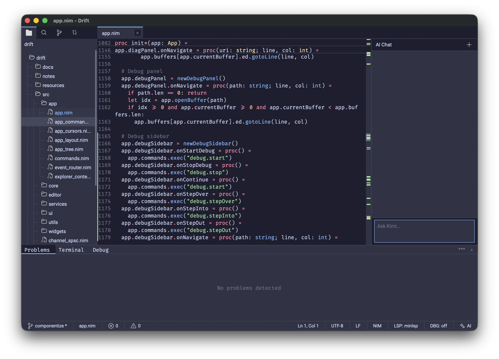

# Drift Editor

> **⚠️ Under active development.** Expect breaking changes and incomplete features.
>
> Drift is built on a fork of uirelays: [`bung87/uirelays#tmp2`](https://github.com/bung87/uirelays/tree/tmp2).
>
> This project synthesizes ideas and code from **three previous editor explorations**, developed through collaborative vibe coding.

A lightweight IDE/text editor written in Nim, built on [uirelays](https://github.com/nim-works/uirelays).



## Features

- **Fast & Lightweight**: Minimal dependencies, quick startup
- **Syntax Highlighting**: Nim, C, C++, JavaScript, Python, Rust, Java, C#, XML, HTML, Markdown
- **File Explorer**: Sidebar directory tree with git status indicators
- **Git Integration**: Status panel, changed file list, diff viewer
- **Side-by-Side Diff**: Open changed files as tabs with "Previous / Current" panes
- **LSP Support**: Hover, go-to-definition, diagnostics (nimlangserver / nimsuggest)
- **Debugging**: DAP client with breakpoints, call stack, variables panel
- **AI Assistant**: Integrated chat panel via ACP (Agent Communication Protocol)
- **Terminal**: Built-in terminal panel at the bottom
- **Command Palette**: Quick access to commands and keyboard shortcuts
- **Theme System**: Dark themes with customizable color tokens
- **Sticky Scroll**: Floating parent-scope headers while scrolling
- **Notifications**: In-app toast notifications

## Architecture

```
src/
├── drift.nim              # Entry point
├── app/
│   ├── app.nim            # Main App object, event loop, render loop
│   ├── app_layout.nim     # Window layout computation
│   ├── app_commands.nim   # Command registry (Ctrl+Shift+P, Ctrl+W, etc.)
│   ├── event_router.nim   # Input event routing
│   └── ...
├── core/
│   ├── document.nim       # Text document model
│   ├── history.nim        # Undo/redo
│   ├── selection.nim      # Selection & multi-cursor
│   ├── config.nim         # TOML configuration
│   └── types.nim          # Domain types
├── editor/
│   ├── state.nim          # EditorState (cursor, scroll, viewport)
│   ├── color_highlight.nim # Syntax highlighting
│   ├── diff_engine.nim    # Myers diff + prefix/suffix fallback
│   ├── git_diff.nim       # Git diff markers
│   └── sticky_scroll.nim  # Sticky scope headers
├── services/
│   ├── lsp_thread.nim     # LSP worker thread (JSON-RPC over TCP)
│   ├── ai_thread.nim      # AI assistant thread (ACP over stdio)
│   ├── dap_thread.nim     # Debug adapter thread (DAP over TCP)
│   └── git.nim            # Git command wrapper
├── ui/
│   ├── diff_view.nim      # Side-by-side diff viewer
│   ├── tabs.nim           # Tab bar
│   ├── file_explorer.nim  # Sidebar file tree
│   ├── git_panel.nim      # Git status panel
│   ├── search_panel.nim   # Find/replace & workspace search
│   ├── ai_panel.nim       # AI chat panel
│   ├── debug_panel.nim    # Debug variables/scopes
│   ├── debug_sidebar.nim  # Debug controls + call stack
│   ├── command_palette.nim # Command picker
│   ├── theme.nim          # Theme system
│   └── ...
├── widgets/
│   └── widgets.nim        # Reusable UI primitives
└── utils/
    ├── file_watcher.nim   # Directory change monitoring
    └── text.nim           # Text utilities
```

See [notes/ARCHITECTURE.md](notes/ARCHITECTURE.md) for the full architecture overview.

## Tech Stack

- **Language**: Nim 2.2
- **GUI**: uirelays
- **Concurrency**: std/atomics + custom SPSC lock-free channels
- **Async I/O**: chronos (LSP/DAP network I/O)
- **Image Loading**: pixie

## Building

### Prerequisites
- Nim 2.2+
- [uirelays](https://github.com/nim-works/uirelays)

### Build
```bash
# Debug build
nim c -o:drift src/drift.nim

# Release build
nim c -d:release -o:drift src/drift.nim
```

### Usage
```bash
# Open editor
./drift

# Open specific file
./drift myfile.nim

# Open directory
./drift /path/to/project

# Custom window size
./drift -w 1600 -h 900
```

## Keyboard Shortcuts

| Shortcut | Action |
|---|---|
| `Ctrl+O` | Open file |
| `Ctrl+Shift+O` | Open folder |
| `Ctrl+S` | Save |
| `Ctrl+W` | Close tab |
| `Ctrl+T` | New file |
| `Ctrl+Shift+P` | Command palette |
| `Ctrl+F` | Find |
| `Ctrl+H` | Replace |
| `Ctrl+Shift+F` | Find in workspace |
| `Ctrl+B` | Toggle sidebar |
| `Ctrl+G` | Go to line |
| `Ctrl+\`` | Toggle terminal |
| `F5` | Start debugging |
| `F9` | Toggle breakpoint |
| `Esc` | Close panel / overlay |

## License

Dual-licensed under **AGPL-3.0** and **Commercial License**.

- Open source / personal / educational use: AGPL-3.0
- Commercial / proprietary / closed-source use: Commercial license required

See [LICENSE](LICENSE) and [LICENSE-AGPL](LICENSE-AGPL) for details.
